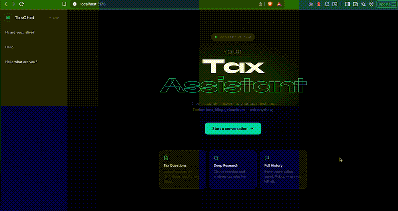

# agentchat

Chat application with Claude Agent SDK for intelligence, session management and sandbox orchestration (Subprocess, Modal, or Firecracker) using FastAPI, and a React (powered by Vite) frontend.



## Architecture

```
  Browser
    │
    │  HTTP / SSE
    ▼
┌──────────────────────────────────────────────────────────┐
│                   React + Vite (port 5173)               │
│                                                          │
│  ┌─────────────┐  ┌──────────────┐  ┌────────────────┐   │
│  │   Sidebar   │  │   ChatArea   │  │ ArtifactsPanel │   │
│  │  (sessions) │  │  (messages)  │  │   (files)      │   │
│  └─────────────┘  └──────────────┘  └────────────────┘   │
└────────────────────────┬─────────────────────────────────┘
                         │ REST + SSE
                         ▼
┌──────────────────────────────────────────────────────────┐
│                  FastAPI (port 8080)                     │
│                                                          │
│  POST /api/v1/chat/          ← streaming (SSE)           │
│  GET/POST/DELETE /api/v1/sessions/                       │
│  GET /api/v1/sessions/{id}/messages                      │
│  GET /api/v1/sessions/{id}/artifacts                     │
│  GET /health                                             │
└──────┬───────────────────────┬───────────────────────────┘
       │                       │
       ▼                       ▼
┌─────────────┐      ┌─────────────────────────────────────┐
│  PostgreSQL │      │            Sandbox                  │
│  (sessions, │      │                                     │
│   messages, │      │  ┌──────────┐ ┌───────┐ ┌────────┐  │
│  artifacts) │      │  │Subprocess│ │ Modal │ │  Fire- │  │
└─────────────┘      │  └────┬─────┘ └───┬───┘ │cracker │  │
                     │       └───────────┴──┬──┘└───┬────┘  │
                     └──────────────────────┼───────┘───────┘
                                            │
                                            ▼
                             ┌──────────────────────┐
                             │  Claude Agent SDK    │
                             │  (agent/agent.yaml)  │
                             │                      │
                             │  ← Anthropic API     │
                             └──────────────────────┘
                                        │
                                        ▼
                             ┌──────────────────────┐
                             │    MinIO / S3        │
                             │  (artifact storage)  │
                             └──────────────────────┘
```

## Structure

- **api/** — FastAPI backend (Python, PostgreSQL, MinIO, SSE chat, sessions)
- **web/** — React + Vite + TypeScript frontend
- **agent/** — Agent configuration and tooling (Claude Agent SDK)
- **orchestrator/** — Firecracker VM orchestrator service
- **infra/** — Terraform infrastructure (AWS, for Firecracker backend)
- **scripts/** — Helper scripts for building Firecracker rootfs and kernel

## Prerequisites

- [Docker](https://docs.docker.com/get-docker/)
- [uv](https://docs.astral.sh/uv/) (Python)
- [Node.js](https://nodejs.org/)

## Quickstart

```bash
# 1. Configure environment
cp api/.env.example api/.env
# Edit api/.env — set at minimum ANTHROPIC_API_KEY

# 2. Install dependencies
make setup

# 3. Start PostgreSQL + MinIO
make infra

# 4. Run DB migrations
make migrate

# 5. Start API (terminal 1)
make api

# 6. Start web (terminal 2)
make web
```

- **Web UI:** http://localhost:5173
- **API:** http://localhost:8080
- **MinIO Console:** http://localhost:9001 (user: `minioadmin` / pass: `minioadmin`)

## Environment

Copy `api/.env.example` to `api/.env`. Minimum required fields:

```env
ANTHROPIC_API_KEY=sk-ant-your-key-here

# PostgreSQL — defaults match docker-compose
POSTGRES_HOST=localhost
POSTGRES_PORT=5432
POSTGRES_DB=agentchat
POSTGRES_USER=agentchat
POSTGRES_PASSWORD=agentchat

# MinIO — defaults match docker-compose
MINIO_ENDPOINT=localhost:9000
MINIO_ACCESS_KEY=minioadmin
MINIO_SECRET_KEY=minioadmin

# Sandbox backend — choose: subprocess | modal | firecracker
SANDBOX_BACKEND=subprocess
```

## Sandbox Backends

### Subprocess (default)

No extra setup. Agents run locally via `uv run` in the `agent/` directory.

```env
SANDBOX_BACKEND=subprocess
```

### Modal (cloud containers)

Agents run in isolated containers on [Modal](https://modal.com).

1. Create a Modal account and obtain your token credentials.
2. Build and push the agent Docker image (`agent/Dockerfile`) to a registry (e.g. Docker Hub, GHCR).
3. Configure `api/.env`:

```env
SANDBOX_BACKEND=modal
MODAL_TOKEN_ID=your-token-id
MODAL_TOKEN_SECRET=your-token-secret
```

### Firecracker (microVMs on AWS)

Agents run in isolated Firecracker microVMs. Requires deploying AWS infrastructure and the orchestrator service. Must be run on Linux with KVM support.

**Step 1 — Deploy AWS infrastructure:**

```bash
cd infra/terraform
terraform init
terraform apply
```

This provisions EC2 (bare-metal for KVM), VPC, IAM, S3, and security groups in `eu-west-1`.

**Step 2 — Build a rootfs from the agent Docker image:**

```bash
# Run on Linux with Docker and root access
./scripts/build-rootfs.sh <your-agent-docker-image> ./build/rootfs.ext4

# Example
./scripts/build-rootfs.sh ghcr.io/your-org/agent:latest ./build/rootfs.ext4
```

**Step 3 — Upload rootfs to S3:**

```bash
./scripts/upload-rootfs.sh ./build/rootfs.ext4 s3://your-bucket/rootfs.ext4
```

**Step 4 — (Optional) Build a Linux kernel:**

```bash
./scripts/build-kernel.sh
```

A pre-built `vmlinux` compatible with Firecracker can also be used.

**Step 5 — Run the orchestrator on the EC2 instance:**

```bash
cd orchestrator
uv run uvicorn main:app --host 0.0.0.0 --port 8000
```

**Step 6 — Configure `api/.env`:**

```env
SANDBOX_BACKEND=firecracker
FIRECRACKER_ORCHESTRATOR_URL=http://<ec2-ip>:8000
FIRECRACKER_API_KEY=your-api-key
```

## Commands

| Command           | Description                        |
| ----------------- | ---------------------------------- |
| `make setup`      | Install API and web deps           |
| `make infra`      | Start Docker (PostgreSQL + MinIO)  |
| `make infra-down` | Stop Docker services               |
| `make migrate`    | Run DB migrations                  |
| `make api`        | Run FastAPI (port 8080)            |
| `make web`        | Run Vite dev server                |
